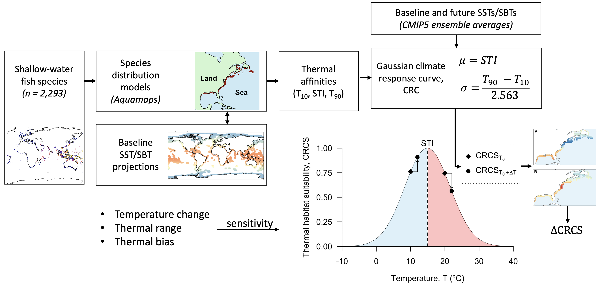

Modelling the impacts of climate change on thermal habitat suitability
for shallow-water marine fish at a global scale
================
Edward Lavender1,2\*, Clive J. Fox1 and Michael T.
Burrows1

<!-- README.md is generated from README.Rmd. Please edit that file -->

1 The Scottish Association for Marine Science, Scottish
Marine Institute, Dunstaffnage, Oban, Scotland, PA37 1QA  
2 Current Address: Centre for Research into Ecological and
Environmental Modelling, The Observatory, University of St Andrews,
Fife, Scotland, KY16 9LZ

\* This repository is maintained by Edward Lavender
(<el72@st-andrews.ac.uk>).

## Introduction

This repository contains methods, written in `R` and organised as an `R
Project`, for Lavender, Fox and Burrows (2021). Modelling the impacts of
climate change on thermal habitat suitability for shallow-water marine
fish at a global scale. PLOS ONE 16(10): e0258184.
<https://doi.org/10.1371/journal.pone.0258184>

In this work, we developed an approach based on species’ thermal
affinities to predict changes in thermal habitat suitability for more
than 2,000 shallow-water marine fish species under future temperature
change scenarios (Figure 1).

***Figure 1. An overview of the methods used to predict change in
thermal habitat suitability for shallow-water fish under future
temperature change.** We started with a list of over 2000 shallow-water
fish species. For each species, we overlaid a model of occurrence with
baseline sea surface temperature (SST) or sea bottom temperature (SBT)
data to estimate quantiles of observed variation in occupied
temperatures, from which we inferred thermal affinities. For example, we
took the median temperature across the species’ range (the species’
thermal index, STI) as the optimum temperature for that species and the
10th (T10) and 90th (T90) percentiles to define the species’ thermal
range (T90 - T10). We used these to parameterise a climate response
curve: a Gaussian model relating temperature to an index of thermal
habitat suitability, termed the climate response curve thermal habitat
suitabilty index (CRCS), with a mean equal to the optimum temperature
and a variance based on the thermal range. The central premise of this
model is that species have a thermal optima around which habitat
suitability declines, an idea that is closely related to the
abundance-centre hypothesis. To predict change in CRCS, we fed this
model with baseline and future temperatures derived from CMIP5 (Coupled
Model Intercomparison Phase Project Phase 5) models. For populations
living below the optimum temperature, in the blue half of the Gaussian
distribution shown, an increase in temperature is assumed to lead to an
increase in thermal habitat suitability. And for populations living
above the optimum temperature, in the red half, an increase in
temperature is assumed to lead to a decline in thermal habitat
suitability. In this way, for every species, we predicted the thermal
habitat suitability in each grid cell in which it currently occurs under
baseline and future temperatures and calculated the change in thermal
habitat suitability. We then synthesised patterns across all species and
Exclusive Economic Zones.*

## Structure

1.  `data-raw` contains raw data for the project.
      - `spatial` contains spatial information.
          - `ne_110m_coastline` contains world coastline data from
            [Natural
            Earth](https://www.naturalearthdata.com/downloads/110m-physical-vectors/).
      - `sdm_aquamaps` contains raw [Aquamaps](https://www.aquamaps.org)
        species distribution model (SDM) predictions (maps) for modelled
        species, obtained via `get_sdm_aquamaps.R` (see below).
      - `occurrence` contains raw occurrence data for modelled species,
        obtained via `process_sdm_aquamaps.R` (see below).
      - `temperature` contains sea surface temperature (SST) and sea
        bottom temperature (SBT) global-scale CMIP5 ensemble average
        projections for (a) historical (1956-2005), (b) mid-century
        (2006-2055) and (c) late-century (2050-2099) time scales under
        Representative Concentration Pathways (RCPs) 4.5 and 8.5. All
        projections were obtained from [NOAA’s Climate Change Web
        Portal](https://psl.noaa.gov/ipcc/ocn/). For SST, for the
        historical scenario, the
        [HADISST](https://www.metoffice.gov.uk/hadobs/hadisst/) dataset
        is also included for comparison to modelled scenarios.  
         
2.  `data` contains processed data.
      - `spptraits.rds` defines modelled species.
      - `spatial` contains processed spatial data.
          - `coastline` contains world coastline data generated by
            `process_coastline.R`.
          - `eez` contains Exclusive Economic Zone (EEZ) boundary data
            from the [Flanders Marine
            Institute](https://www.marineregions.org/eez.php) and
            datasets defining the number of modelled cells and species
            in each EEZ, generated by `process_eez.R`.
          - `species` contains species richness data; namely,
            `map_species_richness.asc`, a raster of the number of
            modelled species, generated by `analyse_spptraits.R`.
          - `sdm_aquamaps` contains processed
            [Aquamaps](https://www.aquamaps.org) SDMs for modelled
            species, generated by `process_aquamaps.R`.
          - `occurrence` contains processed occurrence data for modelled
            species, generated by `process_sdm_aquamaps.R`.
      - `temperature` contains processed SST and SBT temperature
        projections for the time periods and scenarios described above,
        generated by `process_temp.R`.
      - `sensitivity` contains processed ‘sensitivity’ rasters for
        modelled species, generated by `process_sensitivity.R`.
      - `abundance` contains thermal habitat suitability predictions\*
        for SST and SBT for all temperature scenarios, generated by
        `project_abund_1.R`.  
         
3.  `R` contains scripts for data processing, projections and analysis.
      - `get_*` scripts get raw data, where necessary.  
      - `process_*` scripts implement data processing.
      - `project_*` scripts implement thermal habitat suitability
        predictions.
      - `analyse_*` scripts analyse the data and predictions, including
        figure creation.  
      - `helper_*` scripts contain helper functions used in multiple
        scripts.  
         
4.  `fig` contains figures.

Note that the `data-raw`, `data` and `fig` directories are not provided
in the online version of this repository.

## Workflow

### Data acquisition via `get_*`

1.  `get_sdm_aquamaps.R` gets [Aquamaps](https://www.aquamaps.org) SDMs
    for modelled species, via the
    [`aquamapsdata`](https://github.com/raquamaps/aquamapsdata) `R`
    package.

2.  Other raw data are acquired manually (see the links above).

### Data processing via `process_*`

1.  `process_coastline.R` processes the raw coastline data:
      - Forces an extent of {-180, 180, -90, 90} to match species’
        distributions and temperature projections;  
         
2.  `process_spptraits.R` defines a list of modelled species:
      - Focuses on the subset of species with depth ranges found on
        [FishBase](http://www.fishbase.org/search.php);
      - Checks for synonyms;
      - Saves a temporary (reduced) list of species for which
        [Aquamaps](https://www.aquamaps.org) SDMs are acquired and then
        processed (see `get_sdm_aquamaps.R` and
        `process_sdm_aquamaps.R`);
      - Using processed species’ distributions:
          - Checks SDMs;
          - Gets thermal niche parameters from processed temperature
            projections;
          - Gets the full taxonomic breakdown;  
             
3.  `process_sdm_aquamaps.R` processes
    [Aquamaps](https://www.aquamaps.org) species’ distributions:
      - Forces an extent of {-180, 180, -90, 90} to match temperature
        projections;  
      - Replaces 0 for predicted occurrence with NA;
      - Masks land using processed coastline;  
         
4.  `process_temp.R` processes temperature projections:
      - Extracts SST and SBT temperature projections from raw files;
      - Forces an extent of {-180, 180, -90, 90} to match species’
        distributions;
      - Re-samples temperatures to the same spatial resolution as
        species’ distributions;
      - Masks land using processed coastline to match species’
        distributions;  
         
5.  `process_eez.R` processes EEZ data:
      - Gets EEZ areas (in units of grid cells);
      - Gets EEZ latitudinal mid-points;  
         
6.  `process_sensitivity.R` derives species’ sensitivity indices given
    thermal niche parameters derived from (a) SST or (b) SBT. This
    includes:
      - Mean thermal niche width (species thermal range: STR) over
        space;
      - Mean thermal bias (species thermal index (STI) - baseline
        temperatures) over space;
      - Variability in thermal bias over space;

### Projections via `project_*()`

1.  `project_abund_1.R` predicts changes in species’ thermal habitat
    suitability\* under future climate change scenarios.
2.  `project_abund_2.R` synthesises predictions across species.

### Analyses via `analyse_*()`

1.  `analyse_spptraits.R` analyses modelled species, including:
    
      - taxonomic breakdown;
      - depth ranges;
      - distribution;
      - commercial importance;

2.  `analyse_example_thermal_niche.R` analyses an example thermal niche
    and `analyse_sdm_aquamaps_example.R` analyses an example SDM.

3.  `analyse_temp.R` analyses SST and SBT temperature projections, for
    all scenarios.

4.  `analyse_sensitivity.R` analyses species’ sensitivity indices.

5.  `analyse_abund_across_globe.R` analyses thermal habitat suitability
    predictions\* across the globe.

6.  `analyse_abund_across_eezs.R` analyses thermal habitat suitability
    predictions\* across EEZs.

7.  `analyse_scenarios.R` analyses the relative severity of predictions
    under RCP 4.5 and RCP 8.5.

## GitHub packages

This repository uses a number of non-default packages, available from
[The Comprehensive R Archive Network](https://cran.r-project.org). These
can be installed with `install.packages()`. Three packages that are only
available on [GitHub](https://github.com/) are also used:

  - [`aquamapsdata`](https://github.com/raquamaps/aquamapsdata). This
    package is used to acquire SDMs for modelled species.
  - [`prettyGraphics`](https://github.com/edwardlavender/prettyGraphics).
    This package is used for plotting, e.g., via `pretty_map()`.
  - [`utils.add`](https://github.com/edwardlavender/utils.add). The
    `utils.add::basic_stats()` function is also sometimes used as a
    convenient routine for summarising numeric vectors. This could be
    replaced by base `R` functions, such as `summary()`.

## Citation

Lavender, Fox and Burrows (2021). Modelling the impacts of climate
change on thermal habitat suitability for shallow-water marine fish at a
global scale. PLOS ONE 16(10): e0258184.
<https://doi.org/10.1371/journal.pone.0258184>

-----

\*Predictions of the change in thermal habitat suitability are expected
to correspond in broad terms to changes in abundance, with species
increasing in abundance in areas in which thermal habitat suitability
increases and declining in areas in which thermal habitat suitability
declines, hence the naming structure of these files.
